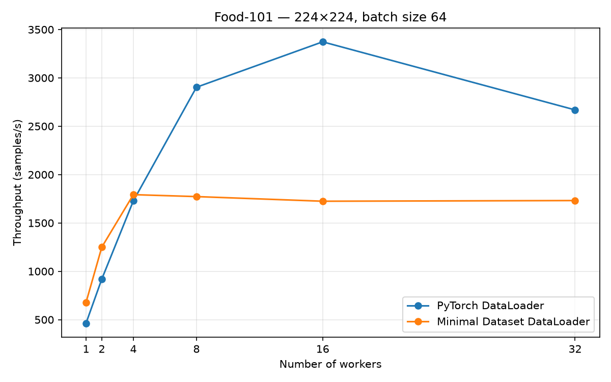
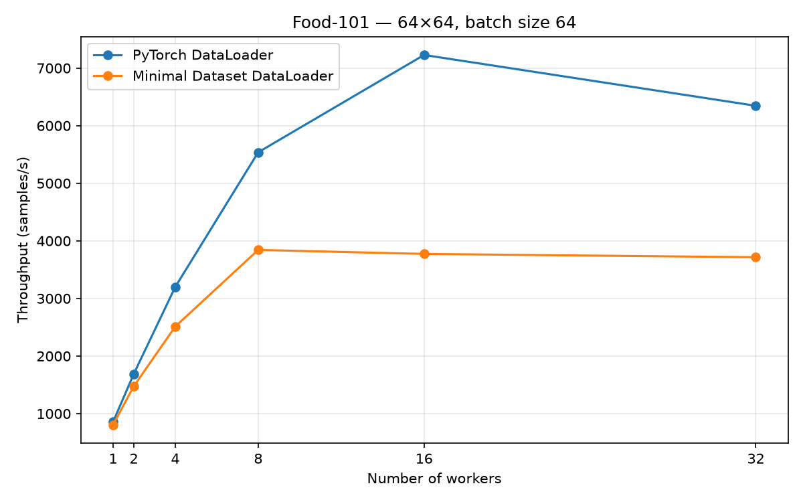
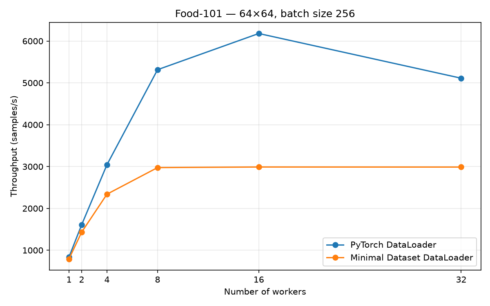

# Real-World Food Classification Benchmark

Real-world validation of the [`minimal-dataset-pytorch`](https://pypi.org/project/minimal-dataset-pytorch/) data-loading library using the Food-101 dataset.

This project evaluates how the custom `minimal_dataset.DataLoader` behaves on a more realistic image workload and compares its throughput against `torch.utils.data.DataLoader`.

The benchmark was developed as an external validation experiment for the Bachelor Project **Minimal Dependency Dataset Library for PyTorch**.

## Objective

The Bachelor Project benchmarks showed that the custom DataLoader could outperform PyTorch's standard DataLoader under the original benchmark conditions.

This repository investigates whether that behavior generalizes to a different image dataset and workload.

The main questions are:

* How does the custom DataLoader scale on Food-101?
* How does image resolution affect scaling?
* Does batch size explain differences between the original benchmark and Food-101?
* How does the custom threaded architecture compare with PyTorch's multiprocessing DataLoader on a real-world image workload?

## Dataset

The experiments use a reproducible subset of **10,000 images** from the Food-101 training split.

The subset is selected using a fixed random seed (`42`).

Images are stored as their original encoded JPEG bytes in a Parquet file together with their numeric labels.

```text
Food-101
    ↓
10,000 reproducibly selected training images
    ↓
original JPEG bytes
    ↓
Parquet
    ↓
minimal_dataset.ParquetDataset
```

The Parquet file is generated by:

```bash
python src/prepare_dataset.py
```

## Benchmark Setup

The same `ParquetDataset` is used for both DataLoaders.

Each sample follows the same image-processing pipeline:

```text
encoded JPEG
    ↓
JPEG decoding
    ↓
resize
    ↓
uint8 tensor
    ↓
batch collation
    ↓
float conversion / normalization
```

The main benchmark configuration is:

* Dataset: Food-101 subset
* Samples: 10,000
* Repetitions: 3
* Workers: 1, 2, 4, 8, 16, 32
* Main batch size: 64
* Resolutions: 224×224 and 64×64
* Metric: throughput in samples/second

The comparison is between:

```python
torch.utils.data.DataLoader
```

and:

```python
minimal_dataset.DataLoader
```

## Results

### Food-101 — 224×224, Batch Size 64

| Workers | PyTorch DataLoader | Minimal Dataset | Minimal / PyTorch |
| ------: | -----------------: | --------------: | ----------------: |
|       1 |              463.1 |       **677.8** |         **1.46×** |
|       2 |              919.8 |      **1249.8** |         **1.36×** |
|       4 |             1728.4 |      **1792.6** |         **1.04×** |
|       8 |         **2903.2** |          1772.5 |             0.61× |
|      16 |         **3372.7** |          1724.6 |             0.51× |
|      32 |         **2668.8** |          1731.6 |             0.65× |



At low worker counts, the custom DataLoader performs very well and is faster than PyTorch from 1 to 4 workers.

However, its throughput reaches a plateau around 4 workers, while PyTorch continues scaling up to 16 workers.

### Food-101 — 64×64, Batch Size 64

| Workers | PyTorch DataLoader | Minimal Dataset | Minimal / PyTorch |
| ------: | -----------------: | --------------: | ----------------: |
|       1 |          **856.3** |           806.9 |             0.94× |
|       2 |         **1690.3** |          1475.7 |             0.87× |
|       4 |         **3200.0** |          2511.6 |             0.78× |
|       8 |         **5537.7** |          3842.7 |             0.69× |
|      16 |         **7227.3** |          3773.3 |             0.52× |
|      32 |         **6345.5** |          3715.9 |             0.59× |



Reducing the target resolution from 224×224 to 64×64 substantially increases throughput for both implementations.

The custom DataLoader also scales farther: its throughput increases up to approximately 8 workers instead of reaching its plateau around 4 workers.

This shows that the amount of per-sample image processing affects the scaling behavior of the custom pipeline.

PyTorch nevertheless continues to scale substantially beyond this point and reaches its maximum throughput at 16 workers.

## Batch Size Control Experiment

To test whether the difference from the original Bachelor Project benchmark was primarily caused by using a smaller batch size, the 64×64 experiment was repeated with a batch size of 256.

### Food-101 — 64×64, Batch Size 256

| Workers | PyTorch DataLoader | Minimal Dataset | Minimal / PyTorch |
| ------: | -----------------: | --------------: | ----------------: |
|       1 |          **837.5** |           792.6 |             0.95× |
|       2 |         **1608.0** |          1431.8 |             0.89× |
|       4 |         **3043.2** |          2339.6 |             0.77× |
|       8 |         **5315.0** |          2975.3 |             0.56× |
|      16 |         **6179.8** |          2989.4 |             0.48× |
|      32 |         **5111.5** |          2988.0 |             0.58× |



Increasing the batch size from 64 to 256 does not recover the scaling behavior observed in the original Bachelor Project benchmark.

The peak throughput of the custom DataLoader actually decreases in this experiment.

Therefore, batch size alone does not explain the difference between the original benchmark and the Food-101 workload.

## Interpretation

The experiments demonstrate that benchmark results for a DataLoader architecture depend strongly on the workload.

The custom DataLoader remains competitive at low levels of parallelism. In the 224×224 experiment it outperforms PyTorch with 1, 2 and 4 workers.

Its main limitation on Food-101 is scalability.

The custom implementation uses worker threads that feed a chunked staging queue, followed by a single orchestrator responsible for assembling batches. On the Food-101 workload, adding workers eventually stops increasing throughput.

Reducing the image resolution moves this saturation point from approximately 4 workers to approximately 8 workers, which indicates that per-sample processing cost influences the observed scaling behavior.

However, these experiments do **not** isolate one definitive low-level cause for the remaining plateau. Possible sources of contention inside the concurrent pipeline require separate profiling and should not be inferred from throughput measurements alone.

## Main Findings

1. The custom DataLoader generalizes successfully to a different real-world image dataset.

2. At low worker counts it remains competitive with, and in some configurations faster than, `torch.utils.data.DataLoader`.

3. The custom implementation scales less effectively than PyTorch on Food-101.

4. Reducing image resolution significantly improves throughput and moves the custom DataLoader's saturation point to a higher worker count.

5. Increasing the batch size from 64 to 256 does not solve the scaling limitation.

6. Performance results from the original Bachelor Project benchmark therefore should not be interpreted as universal superiority over PyTorch's DataLoader.

## Reproducing the Dataset

Install the dependencies:

```bash
pip install -r requirements.txt
```

Prepare the Food-101 subset:

```bash
python src/prepare_dataset.py
```

Validate the installed Minimal Dataset library:

```bash
python src/validate_library.py
```

Run the benchmark:

```bash
python src/benchmark.py
```

## Repository Structure

```text
src/
    prepare_dataset.py      Create the Food-101 Parquet dataset
    validate_library.py     Validate minimal-dataset-pytorch
    benchmark.py            Main 224×224 benchmark
    benchmark_64.py         64×64 benchmark
    benchmark_64_bs256.py   Batch-size control experiment
    plot_results.py         Generate final benchmark figures

results/
    summary/
        benchmark_results.csv
    plots/
        food101_224_bs64.png
        food101_64_bs64.png
        food101_64_bs256.png
```

Raw SLURM outputs are retained separately as experimental records.

## Related Project

This repository is an external validation experiment for:

**Minimal Dependency Dataset Library for PyTorch**

The library provides a lightweight experimental Parquet-backed dataset and a custom multi-threaded DataLoader for PyTorch.

## Limitations

This benchmark measures data-loading throughput only.

It does not measure complete model-training throughput, GPU utilization, convergence, or classification accuracy.

The Food-101 benchmark uses a 10,000-image subset rather than the complete dataset.

The current `ParquetDataset` implementation eagerly loads the Parquet table into memory. This remains an architectural limitation of the experimental library.

The exact cause of the custom DataLoader's scaling plateau on Food-101 has not been fully isolated.

## Author

**Pascal Nague**

Bachelor Project — DFKI
Summer Semester 2026
